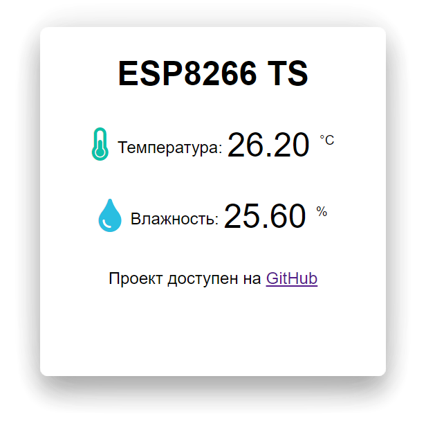
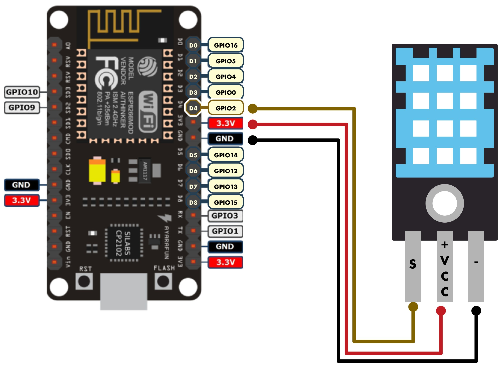

# Умный мониторинг с ESP8266 и Telegram

Это маленький проект представляет собой систему мониторинга температуры и влажности с использованием платформы ESP8266 NodeMCU, датчика DHT, и возможности отправки уведомлений в Telegram.

------------

## Описание

Проект включает в себя следующие компоненты:

- **ESP8266:** Микроконтроллер, используемый для чтения данных с датчика DHT и отправки уведомлений в Telegram.
- **Датчик DHT:** Измеряет температуру и влажность, данный скрипт поддерживает работу с датчикам: DHT 11, DHT 21, DHT 22.
- **Telegram Bot:** Отправляет уведомления о текущей температуре и влажности.

------------

## Функциональность

- Отображение и обновление в реальном времени текущей температуры и влажности на веб-странице.
- HTTP-аутентификация по логину и паролю.
- Возможность мониторинга данных через Telegram.
- Уведомления о критической температуре.

------------

## Использование и сборка проекта

1. Клонируйте репозиторий: `git clone https://github.com/vladios13/ESP8266_TS`.
2. Откройте проект в Arduino IDE.
3. Установите необходимые библиотеки через менеджер библиотек Arduino. ([ESPAsyncTCP](https://github.com/me-no-dev/ESPAsyncTCP "ESPAsyncTCP")), ([ESPAsyncWebServer](https://github.com/me-no-dev/ESPAsyncWebServer "ESPAsyncWebServer")), ([FastBot](https://github.com/GyverLibs/FastBot/ "FastBot")), ([DHT sensor library](https://github.com/adafruit/DHT-sensor-library/tree/master "DHT sensor library")). 
4. Подключите ESP8266 к вашей Wi-Fi сети, указав SSID и пароль в [конфигурации](https://github.com/vladios13/ESP8266_TS/blob/master/ESP8266_TS.ino#L20 "конфигурации").
5. [Создайте бота в Telegram](https://core.telegram.org/bots#how-do-i-create-a-bot "Создайте бота в Telegram") и укажите его [токен](https://github.com/vladios13/ESP8266_TS/blob/master/ESP8266_TS.ino#L69 "токен"). 
6. Укажите [тип используемого](https://github.com/vladios13/ESP8266_TS/blob/master/ESP8266_TS.ino#L27 "тип используемого") датчика DHT в конфигурации.
7. Введите логин и пароль для [Auth-авторизации](https://github.com/vladios13/ESP8266_TS/blob/master/ESP8266_TS.ino#L33 "Auth-авторизации"), а также [ID тех пользователей](https://github.com/vladios13/ESP8266_TS/blob/master/ESP8266_TS.ino#L229 "ID тех пользователей") которым разрешено запускать бота. 
8. Загрузите скомпилированный код на ESP8266.

------------

  
Схема подключения датчика к ESP8266

  
  

------------

## Благодарности

- [shameermohamed](https://github.com/Tech-Trends-Shameer/Esp-8266-Projects/blob/main/ESP-8266-Temperature-Web-Server/esp-8266-temperature-web-server.ino#L60 "shameermohamed") за код с асинхронным веб-сервером. 

------------

## Полезные ссылки
- [Статья в блоге](https://blog.vladios13.com/esp8266_ts/)
- [Telegram](https://t.me/vladios13blog)

Для пожертвований:
- [Yoomoney](https://yoomoney.ru/to/410011568729023 "Yoomoney")